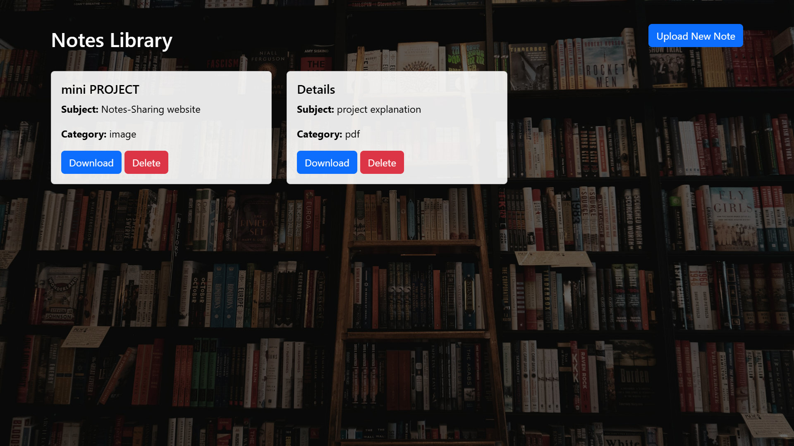

# 📚 Web Application 

This is a simple and clean web application built using **Flask** that allows users to upload, view, download, and delete academic notes and study materials. Notes can be categorized by **title**, **subject**, and **category**, and files are stored on the server.

## 📷 Screenshot

---

## 🚀 Features

- 📂 Upload notes in various formats (PDF, DOCX, PPTX, JPG, PNG, etc.)
- 🗃️ View all uploaded notes in a neat card layout
- ⬇️ Download notes
- ❌ Delete notes
- 🖼️ Custom background image for aesthetic UI
- 💾 SQLite database integration

---

## 🛠️ Tech Stack

- **Backend:** Flask (Python)
- **Frontend:** HTML, CSS (Bootstrap), Jinja2
- **Database:** SQLite
- **Other Tools:** SQLAlchemy, Werkzeug

---

